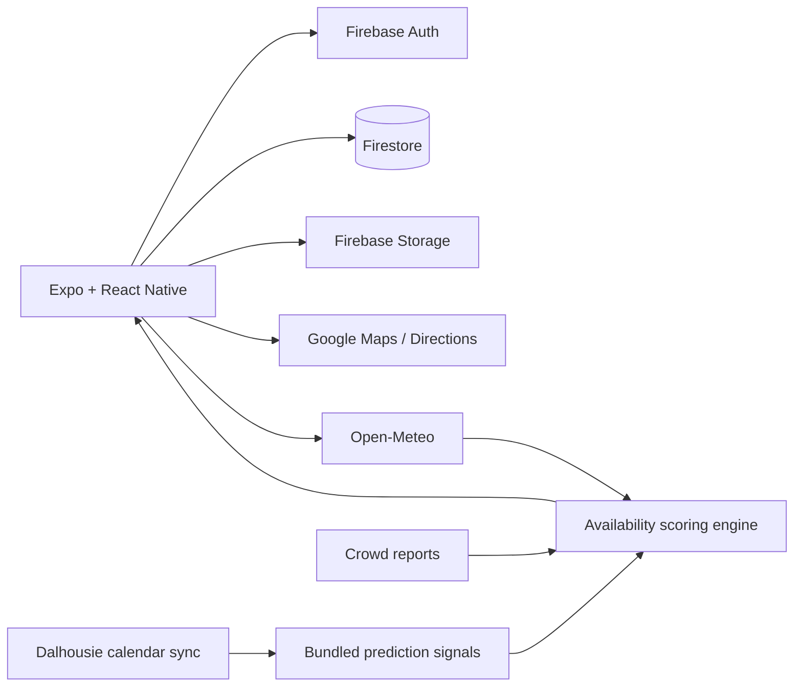

# DalParkAid

[](https://github.com/beaprogram/DalPark/actions/workflows/ci.yml)

A React Native parking assistant for Dalhousie University's Studley and Sexton campuses. DalParkAid combines campus lot data, crowdsourced reports, weather, routing, and a custom scoring engine to help drivers compare likely parking availability.

## Project status

DalParkAid is a team course project on the `dev` default branch. The repository contains the Expo application and an Android export check; it does not include a hosted backend or a public production service. Firebase and Google Maps functionality require your own configured projects and restricted client keys.

## Implemented capabilities

- Map 28 campus parking lots with status colours and searchable filters.
- Rank recommended, nearby, and likely-open lots.
- Blend time, weather, academic-calendar, lot-capacity, and crowd reports in an availability score.
- Submit proximity-checked reports with optional photos.
- Browse and vote on community reports and view a contributor leaderboard.
- Calculate alternate driving routes and provide in-app navigation cues.
- Manage a Firebase-authenticated profile and the user's reports.
- Fall back to bundled lot data when Firestore is unavailable.

## Architecture



## Technology

| Area | Tools |
|---|---|
| Mobile | Expo SDK 54, React Native 0.81, React 19, JavaScript |
| Navigation | React Navigation 7 |
| Maps and routing | react-native-maps, Google Directions API |
| Data and identity | Firebase Authentication, Firestore, Storage |
| Device features | Expo Location, Image Picker, Haptics |
| External data | Open-Meteo and a Dalhousie signal-sync script |

## Local setup

Requires Node.js 18+ and Expo Go or an Android/iOS development environment.

```bash
git clone --branch dev https://github.com/beaprogram/DalPark.git
cd DalPark
npm ci

cp src/config/keys.example.js src/config/keys.js
# Replace placeholders with restricted keys for your own projects.

cp .env.example .env
# Set EXPO_PUBLIC_GOOGLE_MAPS_API_KEY for the native map configuration.

npx expo start -c
```

`src/config/keys.js` and `.env` are deliberately ignored. `app.config.js` reads the
native map key from `EXPO_PUBLIC_GOOGLE_MAPS_API_KEY`. Do not force-add local
configuration or paste keys into issues, screenshots, or documentation.

## Configuration

Create the following client configuration locally:

```javascript
export const KEYS = {
  GOOGLE_MAPS_API_KEY: 'YOUR_RESTRICTED_GOOGLE_MAPS_KEY',
  FIREBASE: {
    apiKey: 'YOUR_FIREBASE_WEB_API_KEY',
    authDomain: 'YOUR_PROJECT.firebaseapp.com',
    projectId: 'YOUR_PROJECT_ID',
    storageBucket: 'YOUR_PROJECT.firebasestorage.app',
    messagingSenderId: 'YOUR_SENDER_ID',
    appId: 'YOUR_APP_ID',
  },
};
```

Restrict the Google key by application identifier and enabled API in Google Cloud. Configure Firebase Security Rules and App Check for any environment exposed beyond local development.

## Prediction engine

`src/utils/engine.js` combines three groups of signals:

1. Deterministic context such as hour, weekday, weather, lot type, campus load, and capacity.
2. Recent reports weighted by age, photo evidence, user trust, and community votes.
3. Historical reports from comparable weekday/hour windows.

The output is an availability score mapped to human-readable lot states. It is an estimate, not an authoritative count of open spaces.

## Repository map

```text
src/components/       Shared UI and map/report controls
src/screens/          Login, map, community, and settings screens
src/data/             Campus lots and generated signals
src/utils/            Prediction, routing, weather, votes, and persistence helpers
scripts/              Academic signal synchronization
assets/               Icons and brand assets
docs/screenshots/     Product capture checklist
```

## Available commands

| Command | Purpose |
|---|---|
| `npm start` | Start Expo |
| `npm run android` | Open the Android development target |
| `npm run ios` | Open the iOS development target |
| `npm run sync:signals` | Refresh bundled academic prediction signals |

GitHub Actions installs the locked dependencies and exports the Android JavaScript bundle with placeholder client configuration. This is a build check, not an end-to-end Firebase test.

## Product evidence

Follow [docs/screenshots/README.md](docs/screenshots/README.md) to add reviewed mobile screenshots. Use synthetic profiles and reports.

## Team and license

Developed by Project Team 11 for CSCI 4176/5708 Mobile Computing at Dalhousie University, Winter 2026.

No open-source license has been selected. Until all contributors agree to one, the code remains copyrighted by its contributors.
